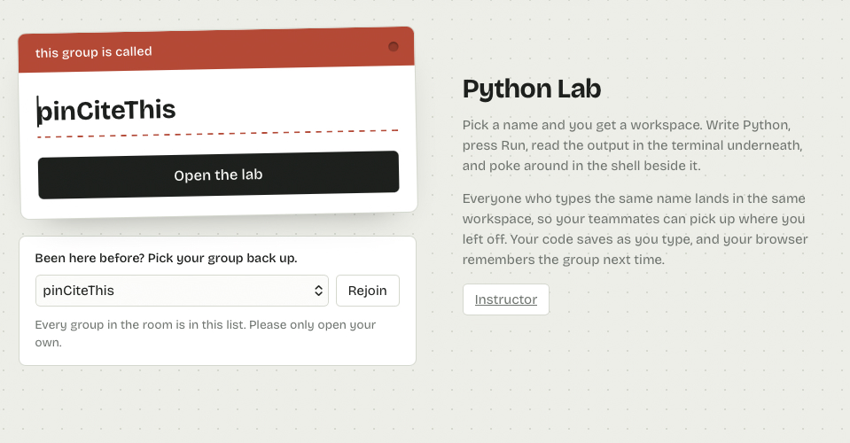
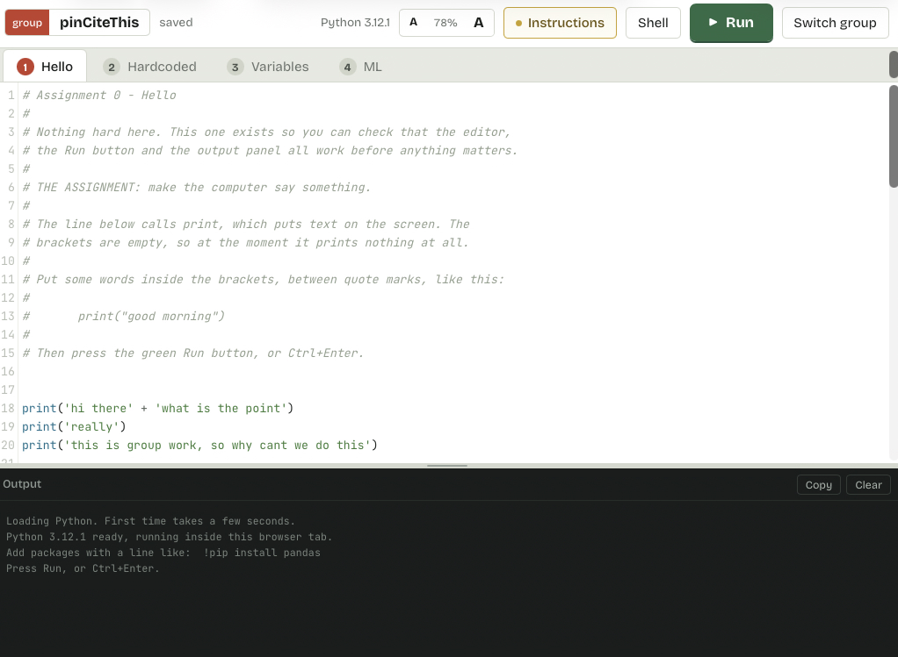
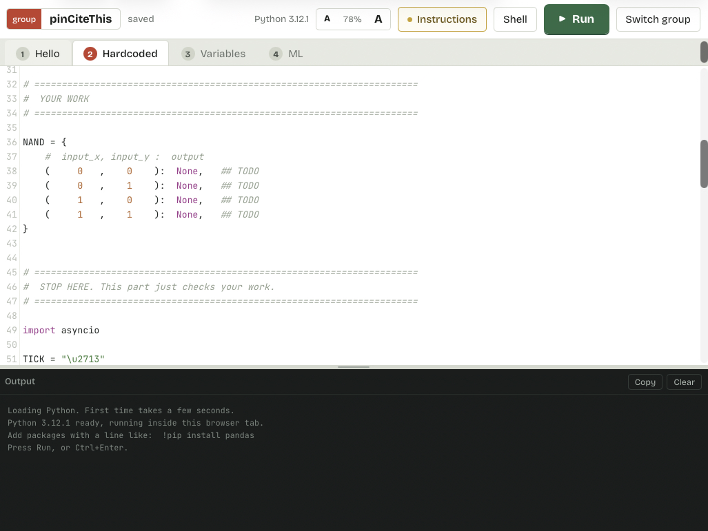
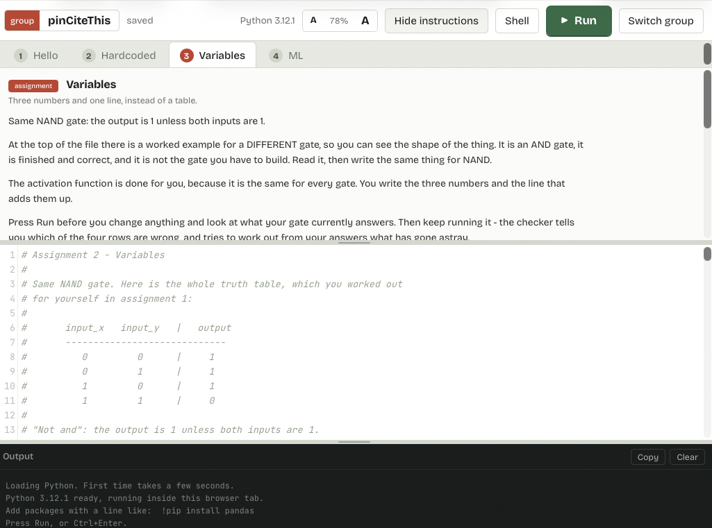

# Group Python Lab

A Flask app for classrooms. Students open a URL, name their group, and get a
Python editor with a Run button and a terminal underneath. You get a roster of
every group and can open any one of them and run their code on the projector. 

Supports multi-editing code!











## Run it

**On macOS, read `START-HERE.md` — it has the exact commands.** Short version:
paste your ngrok authtoken near the top of `app.py`, then double-click
`start.command`.

From a terminal instead:

```bash
cd python-lab
python3 -m venv .venv
./.venv/bin/python -m pip install flask pyngrok
./.venv/bin/python app.py
```

- Students: the ngrok link it prints, or http://localhost:5000
- You: the same link with `/instructor` on the end — password **`admin`**

`--local` skips ngrok and stays on your own machine.

Every setting sits in one block at the top of `app.py`: the authtoken, the
domain, the port, the password.

## Keep the folder together

```
python-lab/
  START-HERE.md             <- macOS setup, one page
  start.command             <- double-click this on a Mac
  app.py
  requirements.txt
  README.md
  starters/                 the three assignments, loaded on first run
    1_table.py                starter code (checker below a STOP HERE line)
    1_table.txt               title, subtitle, then the instructions
    2_neuron.py / .txt
    3_train.py / .txt
  templates/                <- Flask looks for this next to app.py
    base.html
    _editor_scripts.html      CodeMirror + Pyodide + the shared scripts
    index.html                name-tag entry screen
    lab.html                  student: instructions, editor, output, shell
    instructor_login.html     password prompt
    instructor.html           the room, grouped by assignment
    demo.html                 your run-their-code view
    tasks.html                the list of assignments
    task_edit.html            write one, hand it out
  static/                   <- and this
    style.css                 all styling
    runner.js                 the engine: editor, Pyodide, packages, shell
    workspace.js              the three splits, shell pane, copy buttons
    textsize.js               the A / A text size control
    confetti.js               the burst when a student finishes one
    collab.js                 live editing: sockets, cursors, presence
    yjs-bundle.js             Yjs, vendored so nothing loads from a CDN
    lab.js                    student page = engine + autosave + tabs
    demo.js                   your page = engine + group nav, pull, push
    roster.js                 live-refreshing roster
  lab.db                    <- created on first run, holds the class's work
```

`app.py` finds `templates/` and `static/` relative to itself, so you can run it
from any working directory — but the three have to stay in the same folder. If
you ever see `jinja2.exceptions.TemplateNotFound: index.html`, it means
`templates/` isn't sitting next to `app.py`.

## ngrok

Open `app.py` and look at the settings block at the top:

```python
NGROK_AUTHTOKEN = ""          # <- paste yours here
NGROK_DOMAIN = "stroller-coastal-earthly.ngrok-free.dev"
USE_NGROK = True
```

Your authtoken is at https://dashboard.ngrok.com/get-started/your-authtoken

If ngrok can't start, the app says why, prints the command to run the tunnel
yourself in a second terminal, and keeps serving locally rather than dying.

Two things about the free tier:

- **The first visit shows a click-through warning page.** Students press
  "Visit Site" once and won't see it again. Warn them, or thirty hands go up.
- **Debug mode is off on purpose.** Flask's debugger hands a Python console to
  anyone who triggers an error, which is fine on localhost and very much not
  fine on a public URL. Don't switch it back on while the tunnel is open.

## The instructor side

`/instructor` is the whole room on one page, organized **task first, then the
groups working on it**, with a section for groups on nothing yet. Tasks with
nobody on them still show, so you can see everything you've written. It
refreshes every few seconds, so groups appear as students name themselves.

Each group card shows how many lines they've written, when they last edited,
the first few lines of their code, and **1 / 2 / 3 markers** — filled for
assignments they've touched, ringed for the one they have open. Click a marker
to jump straight to that group's answer to that assignment.

### Going group by group

The demo view is built for walking the room in front of the class:

| | |
| --- | --- |
| **Previous / Next** | Buttons in the top bar. **Left and right arrow keys** do the same thing whenever you aren't typing — which is most of the time while presenting. **Alt+left / Alt+right** work even with the cursor in the editor. |
| **Jump** | A dropdown grouped by task, plus a "4 of 12" counter |
| **Run** | Runs their code. Ctrl+Enter too. |
| **Big text** | Bumps the editor and terminal for projecting. On by default here. |
| **Assignment tabs** | Look at any of their three answers. Viewing does *not* move the student — they stay where they are. |
| **Task** | A dropdown that moves *this one group* to a different assignment, for the pair racing ahead. |
| **Reload their code** | Pulls their latest. A banner appears on its own if they edit while you have it open. |
| **Save to group** | Pushes what's on your screen back to them. Asks first. |

Previous and Next walk the same order the roster shows, and **stay on the
assignment you're looking at** — so you can step through the whole room
comparing everyone's answer to the same question.

Editing in the demo view does **not** touch the group's saved code. You can
break their program open in front of the class, try three fixes, and leave
without disturbing anything. Saving back is a separate, deliberate button.

## The four assignments

They ship loaded and ready, and students land on assignment 1. Tabs across the
top switch between them; each group keeps a separate answer per assignment, so
switching never loses work.

**Two logic gates, three ways of getting at them**, with a warm-up in front.
Each stage fails for the reason that forces the next.

### 0. Hello

The starter is `print()` with nothing in the brackets. Students put words
between them. A checker reads back what the run actually printed, so an empty
`print()` is told why nothing happened, and a filled-in one gets four ticks
and confetti before the card through to assignment 1.

It exists so a student can prove the editor, the Run button and the output
panel all work before anything is at stake - and so the slow first load, while
the browser fetches Python, lands on a line that cannot fail.

### 1. Hardcoded

**A NAND gate** - the output is 1 unless both inputs are 1. Not AND, and worth
picking because every chip ever made is built out of NANDs and nothing else.

Two inputs means only four possible rows, so the laziest thing that works is
writing all four answers into a table and looking them up. **All four are
blank and marked `## TODO`** - the dictionary and its keys are there, only the
answers are missing.

```python
NAND = {
    #  A  B
    (  0, 0 ): None,   ## TODO
    (  0, 1 ): None,   ## TODO
    (  1, 0 ): None,   ## TODO
    (  1, 1 ): None,   ## TODO
}
```

The checker walks the four one at a time with a short pause and a tick or a
cross. When all four pass, the program puts the gate in a real circuit, where
wires carry voltages rather than perfect 0s and 1s and the reading comes back
as `0.98` and `0.03`. That is obviously a 1 and a 0, and the table raises
`KeyError`. It knows four inputs, and there are infinitely many readings a
wire can give you.

Then confetti and a card through to assignment 2.

### 2. Variables

Same NAND gate, written the way your notebook writes them. The file opens with
a **worked AND gate** in comments - finished, correct, and deliberately not the
gate they have to build - then hands them an empty one:

```python
def nand_gate_formula(input_x, input_y):
  '''function used to give correct output'''

  ## we are 'experts' and therefore know the bias term and weights
  bias     = 0
  weight_1 = 0
  weight_2 = 0

  ## TODO: a sum of bias, weight_1 times input_x, weight_2 times input_y
  answer = 0

  ## and here is the activation function
  if answer < 0:   ## if the sum is less than 0, output 0
    return 0
  if answer >= 0:  ## if the sum is 0 or more, output 1
    return 1
```

They write the three numbers and the line that adds them up. The activation is
given, because it is identical for every gate.

**Why NAND rather than OR:** it cannot be done with positive weights, and the
proof is two lines a student can follow. Both inputs 0 must output 1, and the
sum there is just the bias, so the bias is 0 or more. Both inputs 1 must output
0, so `bias + weight_1 + weight_2` has to fall below zero - impossible once you
add two positive numbers to a non-negative bias. **At least one weight has to
go negative.** That is the first time they meet a weight that pushes the answer
*down*, and the reason is forced rather than announced.

The checker reads their four answers and diagnoses from the pattern: all four
identical means the inputs never reach `answer`; `0,0,0,1` means they built the
AND example by mistake; all ones means the bias is too high. **Five hints**,
all closed.

**The sting in the tail.** The tidy answer `bias = 1, weights = -1` passes all
four rows - and then fails on the real voltages from assignment 1, because the
sum at `(1,0)` lands on *exactly* zero and only scrapes through on the `>= 0`
in the activation. Nudge the bias to `1.5` and it works. The program works out
which one they picked and explains it either way, so "there is a range of valid
answers, take one from the middle" arrives as something they hit rather than
something they were told.

### 3. ML

**Your Keras code, running unchanged.** The part students read and edit is the
block from your notebook, character for character, comments and all:

```python
training_data = np.array([[0,0],[0,1],[1,0],[1,1]], "float32")
target_data =   np.array([[0]  ,[0]  ,[0]  ,[1]], "float32")
EPOCHS_TO_TRAIN_ON = 500
model = Sequential()
model.add(Dense(16, input_dim=2, activation='relu'))
model.add(Dense(1, activation='sigmoid'))
model.compile(loss='mean_squared_error', optimizer='adam',
              metrics=['accuracy'])
history = model.fit(training_data, target_data, epochs=EPOCHS_TO_TRAIN_ON)
```

**How that is possible.** Keras needs TensorFlow, and TensorFlow has no
WebAssembly build, so neither can run in a browser tab. Rather than rewrite
your code into a different library, the lab writes a stand-in into the tab's
own filesystem as a real importable package - `Dense` layers with glorot
initialisation, mean squared error, the adam optimiser at its Keras defaults,
relu and sigmoid.

That means the file **opens with the same two import lines a student would
write in Colab**, and the interesting code starts on line 5 rather than after
a hundred lines of scaffolding:

```python
from keras.models import Sequential
from keras.layers import Dense
```

The whole file is 70 lines, and everything after the Keras block is commentary
they can scroll past. The code they read is real Keras and will run unchanged
in Colab.

The output looks like Keras too - `Epoch 250/500  loss: 0.0993 - accuracy:
1.0000`, then `accuracy: 100.00%`, then `[[0.]]` and `[[1.]]` from `.predict`.
Epochs print every 25th rather than all 500, so the log stays readable on a
projector, and the file says so.

**It ships as AND, with XOR one line away.** `target_data` is the AND gate you
pasted. A comment at the bottom gives the single line to change for XOR, and
sends students back to assignment 2 first to hunt for three numbers that do
XOR - there are none, and failing to find them is the point. Then the same
code, the same 500 epochs, finds it anyway.

That contrast is the whole assignment: nothing about the network changed
between the two runs, only the answers in `target_data`. What the middle layer
of 16 bought is the ability to be *retargeted* at a problem no three numbers
can solve.

Verified across eight random seeds at exactly your settings - 16 relu, sigmoid
out, mean squared error, adam, 500 epochs - it reaches 100% on XOR every time.

**No scikit-learn any more.** Assignment 3 used to import it, which meant a
large download on the first run. The stand-in needs only numpy, which Pyodide
fetches quickly, so a cold start is now much shorter.

### Editing them

- **In the browser** - `/instructor/tasks`, pick one, edit anything.
- **On disk** - `starters/` holds `1_table.py` with its `1_table.txt` (title,
  subtitle, then the instructions). Only read when the database is empty, so
  delete `lab.db` to reload your edits.

Add a fourth pair of files and it becomes assignment 4.

## Tasks: how they work

`/instructor/tasks` is where you write or change what the class is doing. A
task has three parts:

- **Title** — shown at the top of every student's screen.
- **Instructions** — plain text, line breaks kept, collapsible above their
  editor. As long as it needs to be.
- **Starter code** — what lands in their editor. Write it half-finished, with
  the scaffolding in place and the interesting part left blank, so nobody
  spends ten minutes typing boilerplate.

There's a "Fill in an example" button on the form if you want to see the shape
before writing your own.

When you hand a task out, you choose what happens to the code groups already
have:

| Option | What it does |
| --- | --- |
| Open this assignment for everyone, keep their work | Switches every group's tab. Safe. |
| Open it and wipe their answers back to the starter | Throws away what they wrote **on this one**. Their other assignments are untouched. |

Groups that join *after* you hand out a task pick it up automatically, starter
code and all, so a latecomer lands on the same screen as everyone else.

Students move themselves with the tabs, so you mostly won't need to hand
anything out — it's there for pulling a wandering class back together. To move
a single group, open them and use the **Task** dropdown in their bar.

## Hints

Any assignment can offer hints. They render as closed accordions in the
instructions pane and stay closed until a student decides to open one.

Write them in the `.txt` file as a paragraph starting `HINT:` — the rest of
that first line becomes the summary, everything after it is what opens:

```
HINT: What should the SUM be when nobody turns a key?
If every key is 0 then every term vanishes, and the only thing left
in the SUM is the bias, sitting there on its own.
    0 keys turned   ->   SUM is 0 + bias
So what does the bias have to be?
```

**Do not put a blank line inside a hint.** A blank line ends the block, and
everything after it spills out into the open page where students can read it
without asking. Indented lines inside a hint still render as code, which is
how the example above keeps its arithmetic.

Assignment 2 ships with four, laddered from "start with the easiest row"
through why positive weights can never work and what a negative weight means,
to the three conditions that pin all the numbers down. A student who is
properly stuck can walk down it; one who isn't can ignore the lot.

## Live editing

Everyone in a group shares one editor, and each page keeps itself up to date -
nobody reloads to see what somebody else typed. `LIVE_EDITING = False` at the
top of `app.py` turns it off.

### One request, both jobs

There is a single operation, and it carries the edit out and brings everyone
else's back in the same round trip:

```
POST /api/doc/3   {"since": 41, "update": "<base64>"}
->                {"seq": 43, "updates": ["<base64>", ...], "here": 2}
```

A keystroke and a catch-up are the same call. The page fires it 120 ms after
you stop typing, and again every 500 ms whether or not anyone is typing, so a
change made elsewhere always turns up.

**The first version used WebSockets and it was the wrong choice.** It needed an
extra package, `start.command` only installed packages on the very first run,
and so anyone upgrading kept an environment without it. The route then did not
exist, the page fell back to editing alone, and the only symptom was having to
refresh to see anybody else - a silent failure with a confusing name. Plain
HTTP cannot fail that way: if the request works at all, the sync works, and
there is no dependency to miss. The launcher now also checks its packages on
every run, not just the first.

### Nothing is lost when two people type at once

The document lives in **Yjs**, a CRDT. Two people editing the same line at the
same moment produce edits that merge to the same answer whatever order they
arrive in, so the server never has to decide who wins - the part that is
usually hard and usually wrong. Tested with two people editing blind:

```
  Alice types "bias = 1" at the top
  Ben types "## our group" at the top, at the same moment
  Alice: 'bias = 1\n## our group\n# starter\n'
  Ben:   'bias = 1\n## our group\n# starter\n'
  identical: True   both edits kept: True
```

### It says when it is not working

The old version failed silently. The strip in the top bar now reads
`2 of you editing this together` when it is fine, `reconnecting…` while a
request is failing, and `not syncing — reload the page` once it has given up.
Edits queue up while offline and go out when the connection returns.

### How it fits together

| | |
| --- | --- |
| `static/yjs-bundle.js` | Yjs and the CodeMirror binding, vendored (270 KB). Nothing loads from a CDN. |
| `static/collab.js` | the exchange loop: flush on typing, poll when idle |
| `collab.py` | the rooms: a numbered list of edits per group per assignment |
| `docstate` table | written every three seconds, so a shut laptop costs a moment |

The server treats edits as opaque bytes and has no idea what the code says.
Plain text still reaches the `submissions` table through the ordinary save
endpoint, which is what the roster and the instructor's view read.

**Only the first person in seeds the starter.** Exactly one client is told it
is first; everyone else waits for the document rather than pushing their own
copy of the starter over the top.

**The log collapses.** Every keystroke is an edit, so after 120 of them a
client hands back the whole document and the list is replaced by it.

### The instructor's copy

The demo page keeps a quiet copy of the group's document - synced, but not
bound to your editor, so watching a group does not put your typing in their
file. "Save to group" goes through it, so it lands on their screens
immediately rather than waiting for a reload.

### No cursors

Shared cursors were built and then removed. They needed the awareness
protocol on top of the document sync, which was more to go wrong for something
decorative, and the thing that actually matters - seeing each other's work
appear without reloading - is now the part that is hard to break.

## Pauses, ticks and confetti

Two things task code can do that plain Python cannot.

**Pause without freezing the tab.** Python runs on the page's own thread here,
so `time.sleep` would lock the browser solid and dump every line at the end.
`await asyncio.sleep(0.1)` hands control back, the page redraws, and output
appears a line at a time. The lab runs student code with top-level `await`
already enabled, so a starter can just use it — which is how assignment 1 walks
through its checks and how assignment 3 prints epochs as it trains.

One consequence: a starter that uses top-level `await` will not run under a
plain `python file.py` outside the lab. Wrap the call in `asyncio.run(...)` if
you want to try one at a terminal.

**Celebrate.** Calling `celebrate("well done")` from task code fires the
confetti and reveals a card with a button through to the next assignment. It
respects reduced-motion settings, and the card clears the moment the student
edits their code again.

## The screen

Three draggable dividers, each with a visible grab handle, a hit area that
reaches past the line, and keyboard support:

- between the **instructions** and the editor
- between the **editor** and the output
- between the workspace and the **shell**

The **A / A** buttons in the top bar scale the instructions, the editor and both
output panes together — eleven steps from 62% to 220%, starting at 78% and
remembered per browser.
`Ctrl +`, `Ctrl -` and `Ctrl 0` work too.

Instruction text is written hard-wrapped in the `.txt` files so it reads well in
an editor, but the page reflows it to whatever width the pane is. Indented lines
are left exactly as typed, because those are code.

**Run** is the big green button on the right, with a play glyph. It waves once
the first time Python finishes loading on a given browser, then never again, so
nobody sits there wondering what to press. It respects reduced-motion settings.

**The instructions pane starts closed**, so the code gets the room, and every
assignment carries its own brief in the comment block at the top of the file.
The **Instructions** button wears an amber dot while the pane is hidden, so
nobody has to be told the panel is there. **Shell** behaves the same way, and
both choices stick.

## The shell pane

Every editor page has a shell on the right. It runs against the filesystem
inside that browser tab, so students can see files their code wrote:

```
> ls
> cat output.txt
> pip install seaborn
> help
```

Anything that isn't a known command runs as Python, sharing variables with the
last Run. So after running, `df.head()` or `len(results)` works — which turns
out to be the fastest way to debug in front of a class.

It starts hidden. The **Shell** button in the top bar brings it out, and the
choice is remembered per browser.

Both output panes support Ctrl+A to select just that pane (not the whole page)
and have a Copy button, for when you want a student to paste you their error.

Library housekeeping warnings — the pandas/pyarrow deprecation notice and its
relatives — are filtered out, because they're noise in a classroom. A student's
own warnings still come through. Each run header shows the Python version and
the clock time, and each run ends with how long it took.

## Who can see what

| | Students | Instructor |
| --- | --- | --- |
| Their own group's code | yes | yes |
| Their own task and starter code | yes | yes |
| Any other group's code | no | yes |
| The roster, all tasks, the task editor | no | yes |

Every `/instructor` page and every `/api/instructor` endpoint is behind the
password. A student who guesses the URLs gets bounced to the sign-in page, and
the JSON endpoints return 403 — including the one that writes code, so nobody
can overwrite another group through the API.

The one deliberate gap: the front page lists group **names** in a dropdown so
students can pick their group back up after clearing cookies or closing the
laptop. That means anyone could select someone else's group. The page asks them
not to. If you'd rather not offer that, set `SHOW_GROUP_PICKER = False` at the
top of `app.py` and everyone types their name instead.

Browsers remember a group for 30 days, and also stash the name in local
storage so the dropdown opens on the right one.

## How students see it

| Route | What it does |
| --- | --- |
| `GET /` | Name-the-group screen |
| `POST /` | Creates or joins the group, remembers it in a cookie |
| `GET /lab` | Editor + terminal |
| `POST /api/save` | Autosave, about a second after typing stops |
| `POST /leave` | Switch to a different group |

Groups are keyed by name, case-insensitively. Everyone who types the same name
lands in the same workspace, which is what you want for teammates — but it also
means a group can wander into another group's work by guessing their name.
There's no live co-editing: two people typing in one workspace at once will
overwrite each other.

Work lives in `lab.db` next to `app.py`, so it survives restarts. Delete that
file to reset between classes.

## Packages, and the GPU question

Type a pip line anywhere in your code and it runs before the rest:

```python
!pip install pandas
import pandas as pd
```

`!pip install x`, `%pip install x` and a bare `pip install x` all work, as does
`pip install pandas` typed into the shell pane. Installing happens once per tab;
re-running skips packages that are already there. Any line starting with `!` is
treated as a shell line, so `!ls` works too.

**What installs:** anything with a WebAssembly build or a pure-Python wheel.
That covers numpy, pandas, matplotlib, scipy, scikit-learn, sympy, networkx,
pillow, seaborn, statsmodels, beautifulsoup4 and several hundred more.

**What does not, and cannot:** TensorFlow, Keras, PyTorch, JAX, CuPy, Numba.
The app says so immediately rather than making you wait for a resolver error.

### Why keras and GPU work can't run here

Python here is Pyodide: CPython compiled to WebAssembly, running inside the
browser tab. That is the whole reason there is no sandbox to configure and
no way for a student to touch your machine. It is also the reason there is no
GPU. A WebAssembly tab cannot see CUDA, and TensorFlow has no WebAssembly
build, so `import keras` fails no matter what you pip install first.

This is architectural, not a setting. Three honest options:

1. **Use this tool for the Python, Colab for the deep learning.** Write the
   keras work as a task whose instructions link to a Colab notebook. Colab
   gives every student a free GPU and costs you nothing to run. Students keep
   coming back here for everything that isn't model training.
2. **Swap the library for the lesson.** If the point is how a neural network
   works rather than TensorFlow specifically, scikit-learn's `MLPClassifier`
   runs here today and trains on small datasets in seconds. So does numpy
   written out by hand, which is often the better lesson anyway.
3. **Run Python on the server instead.** This is a real architecture change:
   the server would execute student code, so it needs container-per-student
   isolation, a job queue, and a plan for thirty people sharing one GPU. It
   also reintroduces every security problem this design avoids. Worth it if
   GPU work is the main event; not worth it if it's one week of the term.

I would take option 1. Ask me and I'll build the server-side runner if you
want option 3, but you should know what it costs before you pick it.

## Python runs in the browser, not on the server

Code executes through [Pyodide](https://pyodide.org), CPython compiled to
WebAssembly, inside the tab. The Flask server never runs student code — it only
stores text. So there is no sandbox to configure and nothing a student can write
that touches your machine. That holds for the demo view too: when you run a
group's code, it runs in *your* browser.

Worth knowing before class:

- **First page load is slow.** Pyodide is roughly 10 MB and downloads on load,
  then the browser caches it. Open the demo view once before students arrive.
- **`input()` works.** It's wired to a browser prompt, and the question and the
  answer both get echoed to the terminal like a real console.
- **Most of the standard library works.** Anything needing real sockets, real
  subprocesses, or real files on disk does not.
- **`import numpy` and friends work.** The app calls `loadPackagesFromImports`,
  which fetches supported packages on demand.
- **An infinite loop freezes the tab.** There is no stop button, because
  interrupting Pyodide needs it to run in a Web Worker, and workers can't show
  the prompt dialog `input()` depends on. `input()` matters more in an intro
  class. Student code is saved to the server *before* each run, so a student who
  hits a runaway loop can close the tab and reopen with their work intact — tell
  them Ctrl+W, then come back. Same for you on the projector; nothing is lost.
- **Output appears when the run finishes**, not line by line, for the same
  reason: a tight Python loop blocks the browser from repainting.

If you'd rather have the stop button and live output and can live without
`input()`, move the Pyodide calls in `static/runner.js` into a Web Worker and
add a button that calls `worker.terminate()`. Both pages get it at once.

## Changing things

- **Port, ngrok, database path, roster refresh rate**: the settings block at the
  top of `app.py`.
- **Starter code** new groups get: `starter_code()` in `app.py`.
- **Projector type size**: `body.present` near the top of `static/style.css`.
- **Pyodide version**: the script tag in `templates/_editor_scripts.html`.
  Releases are listed at https://pyodide.org/en/stable/project/changelog.html
- **Editor colors**: the `.cm-s-default` rules in `static/style.css`.
